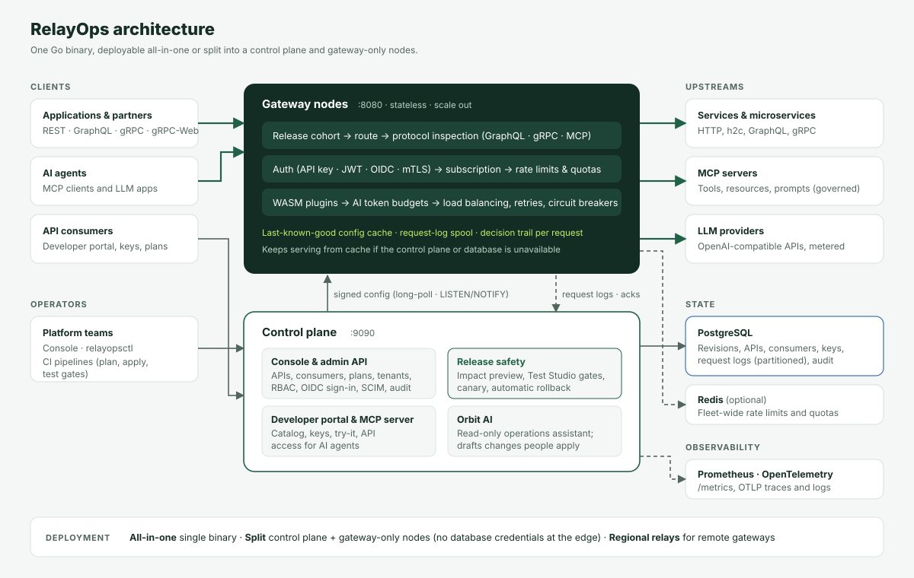
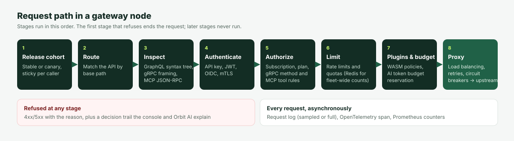
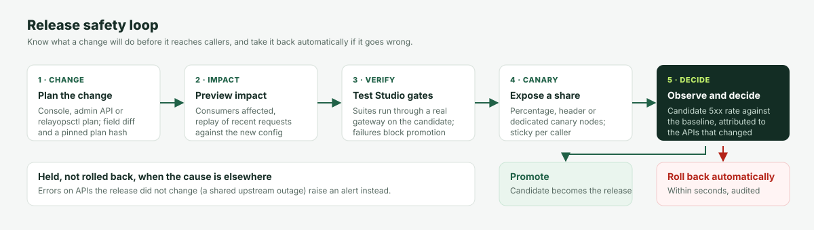

# RelayOps APIM

[](https://github.com/apatilgtn/RelayopsAPIM/actions/workflows/ci.yml)
[](https://go.dev/)
[](docker-compose.yml)
[](README.md#revisions-canaries-and-rollback)
[](LICENSE)

RelayOps is a modern, high-performance API gateway and management platform built around one foundational principle: **know what a change will do before it reaches your callers, and take it back automatically if it goes wrong.**

A single lightweight Go binary executes the high-throughput gateway (data plane), the administrative control-plane API, the operator console, the test studio, the self-service developer portal, and the Model Context Protocol (MCP) server. All state lives in PostgreSQL (or Supabase). Redis is optional for cluster-wide distributed rate limits.

<p align="center">
  
</p>

---

## ⚡ 30-Second Zero-Friction Quickstart

Launch the complete local stack with a single command (requires Docker):

```bash
docker compose up -d
```

### Access Points

| Component | URL | Purpose & Features |
|---|---|---|
| **Control Plane Console** | [http://localhost:9090](http://localhost:9090) | Admin dashboard, live traffic stream, Test Studio gates, SCIM & RBAC (Token: `relayops-admin`) |
| **Developer Portal** | [http://localhost:9090/portal](http://localhost:9090/portal) | Interactive API catalog, OpenAPI downloads, multi-language snippets (`cURL`, `Node.js`, `Python`), and self-service key generator |
| **Data Plane Gateway** | [http://localhost:8080](http://localhost:8080) | High-performance reverse proxy, rate limiting, canary routing, circuit breaking, and WebSocket/SSE streaming |
| **Mock Upstream & LLM Streamer**| [http://localhost:7070](http://localhost:7070) | Simulated backend for REST microservices and OpenAI-compatible streaming deltas |
| **Prometheus Metrics** | [http://localhost:9090/metrics](http://localhost:9090/metrics) | Real-time gateway latency histograms, error rates, and fleet convergence counters |

### 1-Minute Verification

Apply the included production-ready GitOps configuration:

```bash
# Apply declarative APIs, plans, and traffic policies in one shot
export RELAYOPS_URL="http://localhost:9090"
export RELAYOPS_TOKEN="relayops-admin"

relayopsctl apply -f examples/gitops-quickstart/relayops.yaml --auto-approve

# Test the public weather proxy through the gateway
curl -i "http://localhost:8080/weather/v1/forecast?latitude=52.52&longitude=13.41"
```

Explore the complete [examples/gitops-quickstart](examples/gitops-quickstart/README.md) for automated synthetic test assertion gates and canary deployment walkthroughs.

---

## Developer Portal & AI Hub (Model Context Protocol)

The built-in Developer Portal ([http://localhost:9090/portal](http://localhost:9090/portal)) is designed for zero-touch self-service onboarding:

* **Interactive Try-It Workbench**: Test API endpoints directly from the browser. Includes a **"Fill sample payload"** helper that automatically generates valid request bodies, headers, and route parameters for REST and AI APIs.
* **Connect AI & IDE (MCP Hub)**: Connect Cursor, VS Code (Cline / Roo Code / Continue), Claude Desktop, Windsurf, or autonomous LLM agents to your APIs via the **Model Context Protocol (MCP)**:
  * **Dual Transport**: Runs locally via `relayopsctl mcp` (stdio) or connects remotely via `/mcp/sse`.
  * **Agent Tools**: AI assistants dynamically query the catalog (`list_apis`), inspect OpenAPI schemas (`get_api_spec`), execute live requests securely through the gateway (`invoke_api`), and monitor quotas (`get_my_usage`).
  * **1-Click Configs**: Copy-pasteable configuration JSON snippets pre-populated with the developer's actual API keys.
* **Multi-Language Snippets**: Switch between dynamic, copy-pasteable request snippets in **cURL**, **Node.js (Fetch)**, and **Python (requests)** updated live as you adjust parameters.
* **OpenAPI 3.1 & Swagger Downloads**: Download machine-readable schemas (`/portal/api/apis/{id}/openapi.json`) for instant import into Postman, Insomnia, or SDK generators.
* **Self-Service Credentials**: Developers can register applications, request API plan subscriptions, and generate hashed API keys with zero administrator intervention.
* **Console Quick-Switch**: Smoothly transition between the developer portal and the operator console via the top navigation bar.

---

## 🏛️ System Architecture: Data Plane, Control Plane & AI

<p align="center">
  
</p>

RelayOps APIM decouples into three specialized engines inside a single, unified Go runtime:

### 1. Data Plane Gateway (`:8080`)
* **Low-Latency Execution**: Lock-free `atomic.Pointer[Snapshot]` in-memory routing table; p50 0.7 ms / p99 3.6 ms through the gateway in the local soak test ([evidence](docs/evidence/2026-10-05-verification.md)).
* **Cohort & Canary Routing**: Directs callers to stable or canary cohorts stickily by credential or client IP.
* **Security & Auth Pipeline**: Validates SHA-256 API keys, HMAC tokens, and JWT/OIDC JWKS fail-closed checks.
* **Traffic Management**: Token bucket rate limiting, daily quotas, per-target circuit breakers (`open_seconds`), retries with backoff, and weighted/least-requests load balancing.
* **Telemetry**: Asynchronous microsecond latency tracking, OTLP/HTTP W3C trace propagation, and disk-spooled log fallback during database partitions.

### 2. Control Plane (`:9090`)
* **Declarative GitOps Engine**: Strictly typed YAML/JSON with field-level diffs and cryptographic **Plan Hashes** pinning reviewed changes.
* **Autonomous Release Safety Supervisor**: Uses PostgreSQL advisory locks (`pg_try_advisory_lock`) to coordinate a single active supervisor across multi-node clusters. Continuously evaluates candidate 5xx error rates against baseline traffic, automatically aborting canaries or rolling back releases in seconds.
* **Test Studio Assertion Gates**: In-tree synthetic contract verification suites enforcing release quality gates before promotion.
* **Enterprise Identity**: Native SCIM 2.0 (RFC 7643 / RFC 7644) provisioning and OIDC SSO with PKCE and dynamic group-to-role mappings.

### 3. AI & Agentic Layer
* **Model Context Protocol (MCP)**: Native JSON-RPC 2.0 dual-transport engine (stdio subprocess & remote HTTP/SSE stream) bridging IDEs directly to the gateway.
* **AI Model Gateway**: Real-time token usage telemetry (`tokens_prompt`, `tokens_completion`, `tokens_total`), and SSE streaming delta pass-through with immediate flush. Multi-provider fallback is implemented as a helper but not yet applied on the request path.
* **Agent Governance**: HMAC-signed approval tokens for human-in-the-loop validation of consequential agent actions.

---

## How RelayOps compares

RelayOps is not a feature-for-feature replacement for Kong, Apigee, MuleSoft, APISIX, WSO2 or Azure API Management. Most of them have broader plugin ecosystems, protocol coverage and operating history, and several now ship AI gateway and MCP features of their own. Where RelayOps differs is architectural:

| | RelayOps | Typical enterprise APIM |
|:---|:---|:---|
| **Change model** | Every change is an immutable revision. One node can serve stable and canary revisions side by side (percentage, header or node group), and every response says which revision served it. | Route-level traffic splitting, or whole-config canaries delegated to external tooling (Argo Rollouts, Flagger, CI scripts). |
| **Rollback** | Built-in supervisor compares the candidate's fleet-wide 5xx rate with its baseline and rolls back or aborts automatically, with the decision recorded. | Usually an external monitoring and deployment pipeline. |
| **Pre-release evidence** | Replay of recent real traffic, consumer impact, OpenAPI contract diff and Test Studio gates run through the same policy engine as live traffic. | Testing is usually a separate product (Postman/Newman, vendor test tools). |
| **Footprint** | One Go binary and PostgreSQL; Redis optional. Gateways can run without database access (`RELAYOPS_ROLE=gateway`). | Dedicated control and data plane components, often with extra stores (Cassandra, Elasticsearch, etcd, Redis). |
| **Extensibility** | Sandboxed WASM policy plugins on requests and responses (allow, deny, or rewrite headers, body and status; per-API settings; fail closed), a Go SDK and five example plugins, e.g. PII redaction of prompts, upstream answers and MCP tool results ([guide](docs/WASM_PLUGIN_SDK.md)). | Mature plugin models (Lua, Go, JS, WASM, policy languages) with large plugin catalogs. |
| **Protocols** | HTTP; gRPC with all four call types, per-message limits on streams, descriptor-based method checks and rules, gRPC-Web for browsers and JSON transcoding, with gRPC failures counted by release safety ([guide](docs/GRPC_GATEWAY.md)); GraphQL with syntax-tree depth/cost/alias limits, schema validation, hash allowlists, persisted queries and checked subscriptions over WebSocket ([guide](docs/GRAPHQL_GATEWAY.md)); MCP. | Broad protocol support; GraphQL and gRPC depth varies by product and edition. |
| **AI agents (MCP)** | MCP servers as a gateway protocol: per-tool allow/deny by consumer or plan, an approved tool and prompt catalog that every gateway enforces (a changed definition is held fleet-wide, alerted and queued for review), argument validation against approved schemas, resource and prompt rules, per-tool rate limits, and an audit of every tool call ([guide](docs/MCP_GATEWAY.md)). | Emerging; usually a separate AI-gateway product or add-on. |

Measured locally (5 October 2026 soak, 300 req/s with continuous publish/canary/promote churn): gateway latency p50 0.7 ms, p99 3.6 ms ([evidence](docs/evidence/2026-10-05-verification.md)). Capacity on one shared 8-core laptop, with database, Redis, upstream and load generator on the same machine: 2,000 req/s sustained in every run (API key, Redis rate limit and logging; p50 < 1 ms, p99 ≤ 21 ms), and 7,000–11,000 req/s peak per node ([evidence](docs/evidence/2026-10-09-capacity-benchmark.md)). Treat this as a lower bound, not a dedicated-hardware result. Same-host comparison with identical policies ([evidence](docs/evidence/2026-10-10-gateway-comparison.md), laptop, indicative): with API keys and a Redis rate limit, RelayOps (5% logging) peaked at 5.7k req/s against Tyk 6.8k and Kong 1.6k; as a plain proxy it trails both (7.9k against Kong 14.7k and Tyk 10.1k). Check competitor capabilities against their current documentation; editions and versions differ.

---

## What it does

| Area | Capabilities |
|---|---|
| **Release safety** | Every change is an immutable revision. Preview a change against recent real traffic (replay), see which consumers it breaks (consumer impact), and diff OpenAPI contracts for breaking changes before publishing. |
| **Canaries** | Send a canary revision to dedicated canary nodes, to a percentage of callers on every node (sticky by credential), or to requests carrying a header. Promote or abort in one call. |
| **Automatic rollback** | A supervisor compares the candidate's fleet-wide 5xx rate with its baseline and rolls back (or aborts the canary) on a breach. Settings and cooldown are stored in Postgres. A Postgres advisory lock ensures exactly one control-plane node acts. |
| **Config as code** | Strictly validated declarative documents (JSON or YAML), a dry-run plan with field-level diffs, plan hashes that pin a reviewed plan, `relayopsctl`, and a GitHub Action that posts plans on pull requests. |
| **Traffic management** | Multiple upstream targets with weights (`weight: 0` drains), round-robin, random or least-requests balancing, retries on another target, per-target circuit breakers, and active health checks. Breaker and health state survive config reloads. |
| **Tenants** | APIs, plans and consumers belong to a tenant. Administrators can be scoped to tenants with a role in each. Logs, analytics, audit and declarative config are per tenant, and cross-tenant links are rejected. |
| **Enterprise sign-in** | OIDC authorization-code sign-in with PKCE. IdP groups map to platform roles and tenant memberships, re-applied at every sign-in. Includes domain allowlists and just-in-time accounts. |
| **Security** | API keys (SHA-256 at rest, shown once, rotation with grace periods), subscriptions with approval workflows, JWT HS256 (`exp` required, `nbf` honoured), OIDC via JWKS (fails closed), CORS, credentials stripped before forwarding, admin RBAC, OIDC SSO for admins, and a full audit log with before and after state. |
| **Observability** | Every request logged with its decision trail (auth, subscription, rate limit, upstream attempts, cohort). Request diagnosis by ID or trace ID, Prometheus metrics, and OpenTelemetry traces (OTLP/HTTP) with W3C trace context. |
| **Protocols** | HTTP/1.1, HTTP/2 and cleartext HTTP/2 (h2c) upstreams, SSE and streaming (immediate flush), WebSocket upgrades (GraphQL operations inspected), gRPC and gRPC-Web, MCP. AI routes record model and token usage. |
| **Operations** | Hot reload in milliseconds, fleet convergence tracking, last-known-good config cache for database outages, Helm chart, and a distroless non-root image. |

## Quick start (Local Source Build)

Prerequisites: Go 1.26+ and PostgreSQL 13+.

```powershell
psql -U postgres -c "CREATE DATABASE relayops;"
go build -o bin/ ./cmd/...
.\bin\mockupstream.exe -addr :7070      # demo backend
.\bin\relayops.exe                       # migrations run automatically
```

Open http://localhost:9090 (admin token `relayops-admin`; change it in production).

```powershell
$env:RELAYOPS_URL = "http://localhost:9090"; $env:RELAYOPS_TOKEN = "relayops-admin"
.\bin\relayopsctl.exe apply -f examples\gitops\relayops.yaml --auto-approve
curl.exe http://localhost:8080/orders/hello
```

## Configuration as code

Documents use `format_version: "1.0"` and list `plans` and `apis`, matched by `name`. Unknown fields are rejected with a hint. For example, `path` gets the suggestion "use base_path". Secrets are never exported. Reference them as `${secret:NAME}`, and the control plane resolves them from `RELAYOPS_SECRET_NAME` or `NAME`. See [examples/gitops/relayops.yaml](examples/gitops/relayops.yaml).

```bash
relayopsctl export -o relayops.yaml               # live config (YAML or JSON by extension)
relayopsctl plan  -f relayops.yaml                # diff, consumer impact, traffic replay
relayopsctl plan  -f relayops.yaml --detailed-exitcode   # 0 none, 2 changes, 1 error
relayopsctl apply -f relayops.yaml                # shows the plan, asks, applies that exact plan
relayopsctl apply -f relayops.yaml --canary --traffic-percent 10 --auto-approve
relayopsctl rollout status                        # stable/canary revisions, cohort error rates, nodes
relayopsctl rollout promote 42 | rollout abort 42
```

Apply always sends the hash of the plan it showed. The server refuses the apply (HTTP 409) if the document or the live configuration changed in between. `--prune` deletes APIs and plans the document no longer declares, and the plan warns which subscriptions that removes.

The GitHub Action at [.github/actions/relayops-config](.github/actions/relayops-config/action.yml) runs plan on pull requests, writes it to the job summary, and posts it as a PR comment. On merge it applies the reviewed plan, optionally as a canary. [examples/gitops/relayops-config.workflow.yml](examples/gitops/relayops-config.workflow.yml) is a complete workflow.

## Revisions, canaries and rollback

<p align="center">
  
</p>

**What a revision pins.** API definitions (routing, auth settings, limits, traffic policy) and plan definitions (rate limits and quotas) come from the revision a node serves. A canary that tightens a plan therefore affects only the canary cohort.

**What is always live.** API keys and revocations, consumer suspension, and subscription grants (which consumer may call which API, approval status, assigned plan) take effect on every node immediately. A revoked key must never wait for a promotion or come back with a rollback.

**One canary at a time.** While a canary is in flight, fleet-wide publishes are refused (HTTP 409), because they would silently promote the canary's changes. Promote or abort first. A rollback also withdraws any in-flight canary.

| Canary mode | How |
|---|---|
| Node group | `POST /api/revisions/{rev}/canary` with no body. Nodes started with `RELAYOPS_CANARY=true` serve it. |
| Percentage | Body `{"traffic_percent": 10}`. Every node routes about 10% of callers there, sticky by API key, `Authorization` header or client IP. |
| Header | Body `{"header": "X-Canary", "header_value": "1"}`. Matching requests go to the canary. It can be combined with a percentage. |

Responses carry `X-RelayOps-Cohort` (`stable` or `canary`) and `X-RelayOps-Revision`.

**Automatic rollback** runs every 3 seconds on every control-plane node, and the advisory lock lets one evaluate at a time. It compares the candidate (the canary, or the newest release) with its baseline using fleet-wide request logs. A canary is compared over the same recent window, because both revisions serve at once. A release is compared with the baseline's traffic in the window just before it was published. Nothing acts until the candidate has `min_requests`.

Every evaluation reports its `decision_basis`:

| Basis | When | Acts if |
|---|---|---|
| `relative` | baseline has at least `min_baseline_requests` | candidate 5xx rate ≥ threshold **and** more than 1 point above the baseline |
| `absolute` | baseline too small, `insufficient_baseline_action: "absolute"` (default) | candidate 5xx rate ≥ threshold |
| `held` | baseline too small, `insufficient_baseline_action: "hold"` | never; the reason says why |

With a relative comparison, an upstream that was already failing before a release does not roll the release back. A canary is aborted. A release is rolled back to the previous active revision and marked `rolled_back`. The decision, its cooldown and the full evaluation are persisted and written to the audit log.

```json
POST /api/revisions/auto-rollback/config
{"enabled": true, "error_rate_threshold_percent": 5, "evaluation_window_seconds": 60, "min_requests": 20,
 "min_baseline_requests": 20, "insufficient_baseline_action": "absolute", "cooldown_seconds": 300}
```

## Tenants and enterprise sign-in

Every API, plan and consumer belongs to a tenant. Keys, subscriptions and developer apps follow their consumer and API. Names are unique within a tenant. Base paths are unique across the platform because tenants share the gateway. Data from before tenants existed belongs to the `default` tenant, so a single-tenant install works as before.

**Who sees what.**

- **Platform administrators.** A superadmin, or any administrator without tenant memberships, sees every tenant. Sending `X-RelayOps-Tenant: <slug>` scopes a request to one tenant. Without it, reads span all tenants and creates go to `default`.
- **Tenant administrators.** An administrator with memberships sees only their tenants, with the role held in each (`admin`, `operator`, `auditor` or `developer`). With one membership the tenant is implied. With several, reads span them all, and changes need `X-RelayOps-Tenant`. Other tenants' resources answer `404`.
- **Platform-only operations.** Fleet-wide operations stay with platform administrators: revisions, canaries, rollback, drift, upstream state, identity providers, admin users and the live stream. Revision snapshots contain every tenant's configuration.

**Onboarding.**

```bash
# platform admin: create a tenant and its first administrator
curl -X POST $RELAYOPS_URL/api/tenants -H "Authorization: Bearer $TOKEN" -d '{"slug":"acme","name":"Acme","admin_email":"lead@acme.example"}'
# tenant admin: add colleagues (accounts are created without a password; they sign in with SSO)
curl -X POST $RELAYOPS_URL/api/tenants/acme/members -H "Authorization: Bearer $TOKEN" -d '{"email":"dev@acme.example","role":"operator"}'
# GitOps per tenant
relayopsctl apply -f acme.yaml --tenant acme
```

Removing a member ends their sessions immediately. A tenant that still owns resources cannot be deleted. Self-service portal registrations accept only published public APIs from one tenant, and the new consumer belongs to that tenant. `GET /portal/api/catalog?tenant=acme` shows one tenant's catalog.

**SSO.** A superadmin registers an OpenID Connect provider:

```json
PUT /api/admin/oidc-providers/corp
{"issuer": "https://login.corp.example", "client_id": "relayops", "client_secret": "…",
 "allowed_domains": ["corp.example"],
 "claim_mappings": [
   {"claim": "groups", "value": "relayops-acme-admins", "tenant": "acme", "role": "admin"},
   {"claim": "groups", "value": "platform-sre", "role": "operator"}]}
```

- **Sign-in flow.** People sign in through `/api/auth/oidc/corp/start`. The authorization-code flow with PKCE runs against the issuer's discovery document.
- **Token checks.** The ID token's signature, issuer, audience, expiry and nonce are verified. The email must be verified and in an allowed domain. An email already bound to a different subject at the provider is refused.
- **Access from groups.** Memberships granted through claim mappings are replaced at every sign-in, so removing someone from an IdP group removes the access it gave. When mappings are configured and none match, sign-in is refused.
- **Limits.** IdP mappings cannot grant superadmin.
- **Callback URL.** Set `RELAYOPS_PUBLIC_URL` to the control plane's external URL. The callback is `$RELAYOPS_PUBLIC_URL/api/auth/oidc/callback`, and it must be registered with the IdP.

## Traffic policy

```json
"traffic_policy": {
  "load_balancing": "least_requests",
  "targets": [{"url": "http://a:8080"}, {"url": "http://b:8080", "weight": 3}, {"url": "http://c:8080", "weight": 0}],
  "retries": {"attempts": 3, "backoff_ms": 25, "retry_on_status": [502, 503, 504]},
  "circuit_breaker": {"failure_threshold": 5, "open_seconds": 30},
  "health_check": {"path": "/healthz", "interval_seconds": 10, "timeout_ms": 2000, "unhealthy_threshold": 3, "healthy_threshold": 2}
}
```

- **Retries** cover connection errors and the listed statuses, and move to an untried target first. Only idempotent methods are retried, unless `retry_non_idempotent` is set. Bodies up to 1 MiB are replayed, and larger bodies are sent once.
- **Circuit breaker.** A target opens after `failure_threshold` consecutive failures (connection errors or 502/503/504). After `open_seconds` a single probe is let through. When every target is open the gateway returns `503 upstream_circuit_open` without calling the upstream.
- **Health checks** take unhealthy targets out of rotation. If every target is unhealthy, traffic still flows (panic mode) rather than failing everything.
- **Live state** for this node: `GET /api/upstreams/health`.

## Observability

- **Prometheus** (`GET :9090/metrics`):
  - `relayops_requests_total{status}` and `relayops_request_duration_seconds_bucket|sum|count`.
  - `relayops_config_revision`, `relayops_canary_revision`, `relayops_fleet_converged` and `relayops_fleet_nodes_count`.
  - `relayops_upstream_target_healthy`, `relayops_upstream_circuit_open` and `relayops_upstream_{requests,failures,retries,circuit_opens}_total{api_id,target}`.
  - Orbit AI, when configured:
    - `relayops_orbit_questions_total{outcome}`
    - `relayops_orbit_tokens_total{model,kind}`
    - `relayops_orbit_answer_seconds_{sum,count}`
    - `relayops_orbit_tool_calls_total{result}`
    - `relayops_orbit_proposals_total{stage}`

    Each question is also audited as `ORBIT_ASK` with model, tokens, duration and tools. Orbit's model calls go through the gateway as the `orbit-assistant` consumer, so they also appear in request logs and analytics.
- **Tracing.** Set `OTEL_EXPORTER_OTLP_ENDPOINT` (or `OTEL_EXPORTER_OTLP_TRACES_ENDPOINT`), plus optionally `OTEL_EXPORTER_OTLP_HEADERS`, `OTEL_SERVICE_NAME` and `OTEL_TRACES_SAMPLER_ARG`.
  - Each request gets a SERVER span, and each upstream attempt a CLIENT span.
  - Sampling is parent-based, and `traceparent` is propagated to upstreams.
  - Without an endpoint, incoming `traceparent` headers pass through unchanged.
  - The trace ID is returned in `X-RelayOps-Trace-Id`, stored with the request log, and searchable in the logs view.
- **Diagnosis.** `GET /api/requests/{request_id}/diagnose` explains why a request got its status. Each log records `auth_status` (`ok` or the failure reason), `subscription_status` (`active`, `not_required`, `pending_approval`, `rejected`, `disabled` or `not_subscribed`) and `rate_limit_status` (`ok`, `rate_limited`, `quota_exceeded` or `quota_backend_unavailable`).

## Orbit AI (operations assistant)

Orbit answers questions about the gateway in the console: press **Ask Orbit** or ⌘K / Ctrl+K, or use **Ask Orbit about this request** in a decision trail.

- **Read-only.** Orbit looks things up with tools (traffic summary, request logs, policy refusals, request diagnosis, APIs, fleet, releases, canary status, auto-rollback, audit log). It cannot change configuration. When a change would help, it says what to change and where, and a person applies it.
- **Same permissions as the user.** Each tool is an in-process request through the authenticated `/api` stack with the asking user's credentials, so role rules and tenant scope apply exactly as in the console. For example, an operator asking about the audit log gets "your role cannot see that". Auditors may ask questions.
- **Shows its evidence.** Every answer lists the data Orbit checked.
- **Needs attention (signals).** Live traffic, the Orbit panel and a badge on the Ask Orbit button show findings from fixed rules, not the model (`GET /api/orbit/signals`):
  - per-API error or latency spikes over the last 15 minutes, against the 24 hours before them;
  - refusal surges;
  - automatic rollbacks;
  - canaries in flight;
  - gateways not on the current revision;
  - MCP definitions held for review;
  - APIs with no authentication and no rate limit.

  Each finding has **Ask Orbit** for an explanation. Signals work without a model.
- **Proposals, never silent changes.** Orbit can draft changes to API settings: rate limit, quotas, timeout, authentication (none or API key), subscription approval, visibility, enabled. A draft shows the change, the change-impact preview and, for rate limits, how many requests each client's busiest minute in the last 24 hours would have had refused.
  - The draft is a signed token, valid for 30 minutes, for the user who asked.
  - **Apply** (`POST /api/orbit/proposals/apply`) runs as that user, so auditors cannot apply.
  - Apply is refused if the API changed after the draft.
  - Each applied draft is audited as `ORBIT_PROPOSAL_APPLIED`.
- **Secrets stay in the control plane.** Credential fields (headers, secrets, tokens, keys, passwords) are removed from tool results before they reach the model. Other gateway data used to answer does go to the configured model provider. Use a self-hosted model or a RelayOps AI route if that matters.
- **Audited and limited.** Each question is audited as `ORBIT_ASK`, recording the tools used but not the conversation. Each user can ask 20 questions per minute.
- **Any OpenAI-compatible model.** Use one that supports tool calling, such as `meta/llama-3.3-70b-instruct` on NVIDIA NIM, GPT-4.1, or Llama 3.1+ on Ollama/vLLM. Models without tool calling still work: Orbit answers from a fixed snapshot of gateway data.

| Variable | Description |
|---|---|
| `RELAYOPS_ORBIT_BASE_URL` | Chat completions base URL, e.g. `https://integrate.api.nvidia.com/v1`. Pointing it at a RelayOps AI route puts Orbit's own usage under your budgets and audit. |
| `RELAYOPS_ORBIT_MODEL` | Model name, e.g. `meta/llama-3.3-70b-instruct` |
| `RELAYOPS_ORBIT_API_KEY` | Sent as `Authorization: Bearer …` |
| `RELAYOPS_ORBIT_FALLBACK_MODEL` | Optional. Answers when the main model is unknown, retired, overloaded or unreachable, using the same endpoint and key. Counted in `relayops_orbit_fallback_answers_total`. |

Without a model, the console still shows Orbit with setup instructions, and `POST /api/orbit/ask` returns `503 orbit_not_configured`.

## Deployment

- **Kubernetes.** Use [deploy/helm/relayops](deploy/helm/relayops). It needs an external PostgreSQL, set with `database.url` or `database.existingSecret`. Optional extras are Redis, dedicated canary nodes, an HPA, a PDB, Ingress, a ServiceMonitor and OTLP export. Pods run non-root with a read-only root filesystem. The admin token is generated once and kept across upgrades.
- **Containers.** The image contains `relayops`, `relayopsctl` and `mockupstream`. `docker compose up` runs Postgres, the gateway and the mock backend.
- **Database outages.** Running gateways keep serving the configuration they have in memory, and catch up automatically when Postgres returns. A node that starts while Postgres is down serves its own last-known-good cache (`data/last_known_good_config.<node-id>.json`). Request logs that cannot be written are spooled to `data/request_log_spool.<node-id>.jsonl`. The spool is capped by `RELAYOPS_LOG_SPOOL_MB`, 256 MB by default. It is replayed in order once Postgres is back, with at-least-once delivery. Losses are counted in `relayops_request_logs_dropped_total{reason}`. The control plane answers admin and portal API calls with `503 database_unavailable`. `/metrics` stays up and reports `relayops_control_plane_database_up 0`.
- **Scaling.** Run N nodes against the same Postgres. They all hot-reload from the same NOTIFY stream. Set `RELAYOPS_REDIS_URL` for exact cluster-wide rate limits and quotas, otherwise limits apply per node. Partition `request_logs` or ship logs elsewhere at tens of millions of rows per day.
- **Split deployment (gateway-only nodes).** Gateways can run without database access.
  - **Roles.** Set `RELAYOPS_ROLE=control-plane` on the nodes that hold the database. Set `RELAYOPS_ROLE=gateway` plus `RELAYOPS_CONTROL_PLANE_URL` on gateways, and give both the same `RELAYOPS_DATAPLANE_TOKEN`.
  - **What a gateway-only node does.** It serves only the proxy, plus `/metrics`, `/healthz` and `/readyz` on `RELAYOPS_STATUS_ADDR` (`:9091`). It gets configuration from the control plane through a long-poll that picks up a change in about 200 ms locally. Acknowledgements, request logs and AI budgets go through the control plane's node API.
  - **Outages.** When the control plane is down, a gateway-only node keeps serving its last-known-good configuration and spools its logs.
  - **Helm and Compose.** In Helm, set `mode: split`. In Compose, run `RELAYOPS_DATAPLANE_TOKEN=<32+ chars> docker compose --profile split up -d`.
  - **Details.** See the [design](docs/DATAPLANE_SEPARATION_DESIGN_2026-10-09.md) for the security model, failure behaviour and roadmap.

| Env var | Default | Description |
|---|---|---|
| `RELAYOPS_DATABASE_URL` | `postgres://postgres@localhost:5432/relayops?sslmode=disable` | PostgreSQL DSN |
| `RELAYOPS_REDIS_URL` | `redis://localhost:6379/0` | Redis for cluster-wide limits; `disabled` for in-memory only |
| `RELAYOPS_PROXY_ADDR` / `RELAYOPS_ADMIN_ADDR` | `:8080` / `:9090` | Listeners |
| `RELAYOPS_ADMIN_TOKEN` | `relayops-admin` | Admin bearer token. **Change in production.** Empty disables auth. Named admin accounts have no default password; set one when creating the account, or use SSO |
| `RELAYOPS_SSO_SECRET` | (unset) | HS256 signing secret for SSO identity tokens, at least 32 bytes. Unset disables HS256 SSO; registered OIDC providers still work |
| `RELAYOPS_NODE_ID` / `RELAYOPS_NODE_GROUP` / `RELAYOPS_CANARY` | hostname / `default` / `false` | Node identity and canary role |
| `RELAYOPS_LOG_RETENTION_HOURS` | `72` | Request-log retention |
| `RELAYOPS_LOG_SPOOL_MB` | `256` | On-disk spool for request logs during database outages; `0` disables |
| `RELAYOPS_RESYNC_SECONDS` | `60` | Safety-net full config reload interval |
| `RELAYOPS_PUBLIC_URL` | derived from the request | External URL of the control plane; builds the OIDC callback URL |
| `RELAYOPS_ADOPT_SQL_CHANGES` | `true` | Publish direct SQL edits to `apis`/`plans` as revisions |
| `RELAYOPS_SECRET_<NAME>` | | Values for `${secret:NAME}` references |
| `RELAYOPS_ROLE` | `all` | `all` (gateway and control plane), `control-plane` (no proxy listener), `gateway` (no database, admin or console) or `relay` (regional node API cache for gateways; see the [design](docs/DATAPLANE_SEPARATION_DESIGN_2026-10-09.md#regional-relays-phase-4)) |
| `RELAYOPS_DATAPLANE_TOKEN` | (unset) | Shared node API token, at least 32 characters. Setting it on a control plane enables `/dataplane/v1/*`; gateway-only nodes require it |
| `RELAYOPS_CONTROL_PLANE_URL` | | Gateway-only nodes: control plane base URL. Must be `https://` unless `RELAYOPS_DATAPLANE_ALLOW_HTTP=true` |
| `RELAYOPS_STATUS_ADDR` | `:9091` | Gateway-only nodes: `/metrics`, `/healthz`, `/readyz` listener |
| `RELAYOPS_TLS_CERTS_DIR` | (unset) | Per-hostname gateway certificates chosen by SNI: `<host>.crt` + `<host>.key`, `_wildcard.example.com.crt` for `*.example.com`. `RELAYOPS_TLS_CERT_FILE` is the fallback |
| `RELAYOPS_TLS_CLIENT_CA_FILE` / `RELAYOPS_TLS_CLIENT_AUTH` | (unset) / `optional` | Verify client certificates on the gateway listener (`optional` or `require`), for `auth_type: mtls` APIs |
| `RELAYOPS_TRUSTED_PROXY_CIDRS` | (unset) | Ingresses whose forwarded client-certificate headers (`X-SSL-Client-*`) are accepted. Client-sent certificate headers are always discarded otherwise |
| `RELAYOPS_ALERT_WEBHOOK_URL` | (unset) | Webhook (Slack/Teams compatible) for alerts such as MCP tools or prompts held for review |
| `RELAYOPS_WASM_PLUGINS_DIR` | (unset) | `*.wasm` policy plugins; an API lists them in `traffic_policy.wasm_plugins` and they run after auth and rate limits. A missing plugin refuses the API's requests (503) |
| `RELAYOPS_AUTO_ROLLBACK_INTERVAL_SECONDS` | `3` | How often the auto-rollback supervisor evaluates. Each run is about 2 KB of database reads; use 15 on metered hosted databases (see [docs/AWS_SUPABASE_DEPLOYMENT.md](docs/AWS_SUPABASE_DEPLOYMENT.md#database-egress)) |
| `RELAYOPS_LOG_EXPORT` | (unset) | `otlp` sends every request log (before sampling) as OTLP log records to `OTEL_EXPORTER_OTLP_LOGS_ENDPOINT` (or `OTEL_EXPORTER_OTLP_ENDPOINT` + `/v1/logs`), with `OTEL_EXPORTER_OTLP_HEADERS` |
| `RELAYOPS_LEADER_ELECTION` | `postgres` | `kubernetes`: only the control-plane replica holding a Lease runs the auto-rollback supervisor (Helm `controlPlane.leaderElection`) |
| `RELAYOPS_LOG_SAMPLE_RATE` | `1` | Fraction (0-1] of successful requests written to `request_logs`. Errors are always kept; kept rows are weighted so analytics and auto-rollback still count every request |
| `RELAYOPS_DATAPLANE_API` | `false` | Serve the node API with per-node credentials only (always on for `control-plane`). Issue credentials with `POST /api/admin/dataplane/credentials` |
| `RELAYOPS_DATAPLANE_SIGNING_KEY` / `RELAYOPS_DATAPLANE_VERIFY_KEYS` | (unset) | Ed25519 key pair from `relayops dataplane-keygen`: the control plane signs configuration, gateways refuse unsigned or untrusted configuration and verify their cache |
| `RELAYOPS_ADMIN_CLIENT_CA_FILE`, `RELAYOPS_DATAPLANE_REQUIRE_CLIENT_CERT` | (unset) | Control plane: verify client certificates, and require one for the node API |
| `RELAYOPS_DATAPLANE_CA_FILE`, `RELAYOPS_DATAPLANE_CLIENT_CERT_FILE`, `RELAYOPS_DATAPLANE_CLIENT_KEY_FILE` | (unset) | Gateway-only nodes: trust a private CA and present a client certificate (mTLS) |
| `RELAYOPS_GATEWAY_URL` | local proxy listener | Gateway the control plane calls for the portal workbench, MCP `invoke_api` and Test Studio; set it on control-plane nodes |

**Direct SQL edits** to the `apis` and `plans` tables are detected within milliseconds and published as a new revision by `direct_sql`, with an audit entry. They are served, versioned and reversible like any other change. While a canary is in flight, adoption waits until it is promoted or aborted. `GET /api/system/drift` shows whether the tables differ from the newest revision. Set `RELAYOPS_ADOPT_SQL_CHANGES=false` to require every change to go through the admin API or `relayopsctl apply`.

## Admin API (selected)

All endpoints need `Authorization: Bearer <token>`.

| Method | Path | |
|---|---|---|
| GET/POST, GET/PUT/DELETE | `/api/apis`, `/api/apis/{id}` | APIs (including `traffic_policy`) |
| POST | `/api/apis/{id}/preview-change`, `/replay-preview`, `/consumer-impact`, `/contract-diff` | Change previews |
| GET | `/api/system/drift` | Whether the tables differ from the newest revision |
| GET/POST | `/api/system/export`, `/api/system/plan`, `/api/system/apply` | Configuration as code (`prune`, `plan_hash`, `rollout=canary`, `traffic_percent`, `canary_header`) |
| GET | `/api/revisions`, `/api/revisions/compare`, `/api/revisions/{rev}` | Revision history |
| POST | `/api/revisions/{rev}/canary`, `/promote`, `/abort`, `/rollback` | Rollout control |
| GET | `/api/revisions/{rev}/canary-status` | Split, convergence and canary-vs-baseline error rates |
| GET/POST | `/api/revisions/auto-rollback/config`, `POST /api/revisions/auto-rollback/evaluate` | Auto-rollback |
| GET | `/api/fleet/status`, `/api/upstreams/health` | Fleet convergence; upstream targets on this node |
| GET | `/api/logs`, `/api/analytics/summary`, `/api/requests/{id}/diagnose`, `/api/audit-logs` | Observability |
| | `/api/plans`, `/api/consumers`, `/api/keys`, `/api/subscriptions`, `/api/admin/users` | Access management |
| GET/POST, PUT/DELETE | `/api/tenants`, `/api/tenants/{slug}` | Tenants (`admin_email` onboards a first tenant admin) |
| GET/POST, DELETE | `/api/tenants/{slug}/members`, `/api/tenants/{slug}/members/{user_id}` | Tenant memberships |
| GET, PUT/DELETE | `/api/admin/oidc-providers`, `/api/admin/oidc-providers/{name}` | Identity providers (superadmin) |
| GET | `/api/auth/oidc/providers`, `/api/auth/oidc/{name}/start`, `/api/auth/oidc/callback` | SSO sign-in (public) |

Gateway health: `GET :8080/__relayops/health`. Control-plane health: `GET :9090/healthz`.

## Testing

```bash
go test ./...                                                   # unit tests; integration tests skip
RELAYOPS_TEST_DATABASE_URL="postgres://postgres@localhost:5432/postgres?sslmode=disable" \
RELAYOPS_REQUIRE_INTEGRATION=1 go test ./...                    # everything; a missing database fails
```

CI ([.github/workflows/ci.yml](.github/workflows/ci.yml)) runs the full suite with the race detector against PostgreSQL 16 and Redis on every push and pull request, with `RELAYOPS_REQUIRE_INTEGRATION=1`. It uploads the `go test -json` results. CI also builds the container image and lints and renders the Helm chart.

With `RELAYOPS_TEST_DATABASE_URL` set, the integration tests create and drop a throwaway database. Without it they are skipped. They cover:

- revision isolation and canary abort;
- the advisory lock and coordinated rollback across two control planes;
- plan/apply over HTTP;
- a gateway node partitioned from Postgres that keeps serving, then catches up when the partition heals;
- a node cold-starting from its own cache during the outage;
- header canaries across two nodes;
- upgrading a database written by the previous release: data is preserved and served, and the security fixes are applied;
- a `pg_dump` / `pg_restore` round trip taken mid-canary, which restores an equivalent control plane;
- tenant isolation: scoped reads, `404` across tenants, per-tenant roles, cross-tenant link rejection, platform-only operations, scoped logs, analytics and audit, per-tenant declarative apply, delegated onboarding and portal rules;
- OIDC sign-in against a fake identity provider: PKCE, nonce, audience, expiry, domain, verified email, subject binding, single-use state, and group-driven access that is granted and revoked.

**Soak testing.** `go run ./cmd/soak` drives sustained traffic across one or more gateway nodes while publishing revisions and running canary-then-promote cycles. It writes a JSON and Markdown report with latency percentiles, status codes, per-node counts and pass/fail invariants. For gateway-only latency, start the mock with `-jitter-ms 0`. Results from a local run are in [docs/evidence](docs/evidence). The PowerShell suites in `scripts/` exercise a running instance on the default ports. Run them against an empty database. `e2e.ps1` edits the `relayops` database directly with `psql`, so never point it at a database you care about. `test_advanced_features.ps1` calls NVIDIA with `RELAYOPS_SECRET_NVIDIA_API_KEY`. `test_enterprise_platform.ps1` needs the server started with the same `RELAYOPS_SSO_SECRET`.

## Project layout

```
cmd/relayops/        server binary (gateway + control plane)
cmd/relayopsctl/     configuration-as-code CLI
cmd/mockupstream/    demo backend;  cmd/loadgen/  traffic generator
internal/gateway/    data plane: pipeline, snapshots, cohorts, upstream pool, breaker, health checks
internal/policy/     shared policy engine (live traffic and replay)
internal/admin/      control-plane API, plan/apply, rollout, auto-rollback, portal
internal/store/      Postgres access, revisions, embedded migrations
internal/tracing/    W3C trace context and OTLP/HTTP exporter
internal/analytics/  metrics, log batching, retention
deploy/helm/         Helm chart;  examples/gitops/  sample document and workflow
.github/actions/     GitHub Action for plan/apply
```

## Roadmap

SCIM provisioning · tenant-filtered live stream and dashboard tenant switcher · per-tenant gateway hostnames · gRPC and GraphQL routing · mTLS to upstreams and clients · request/response transformation · response caching · AI gateway policies (multi-provider routing, prompt guards) and an MCP tool gateway · Kubernetes operator and Terraform provider.

## License

RelayOps is licensed under the [Apache License, Version 2.0](LICENSE). See [NOTICE](NOTICE) for attributions.
